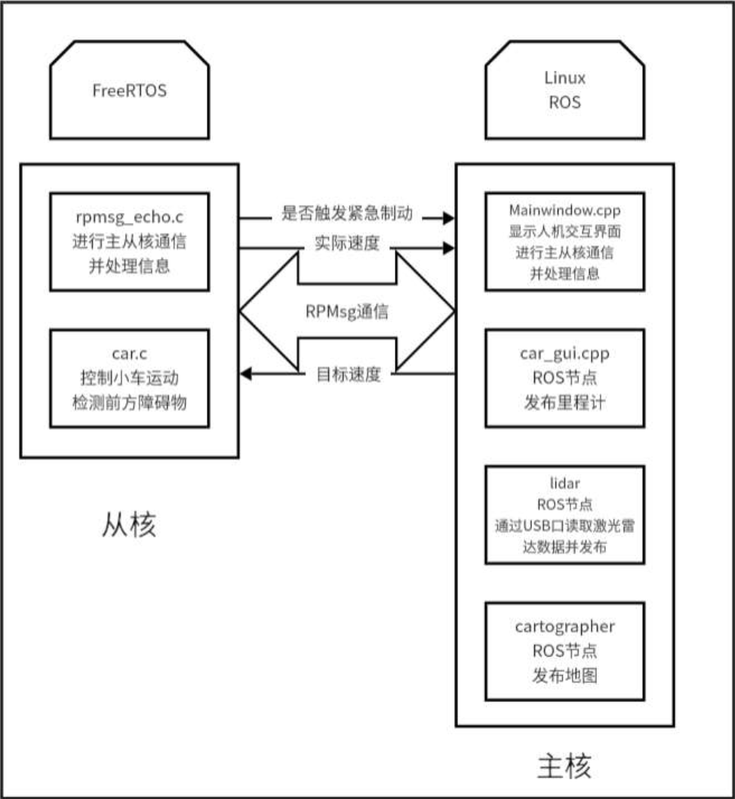
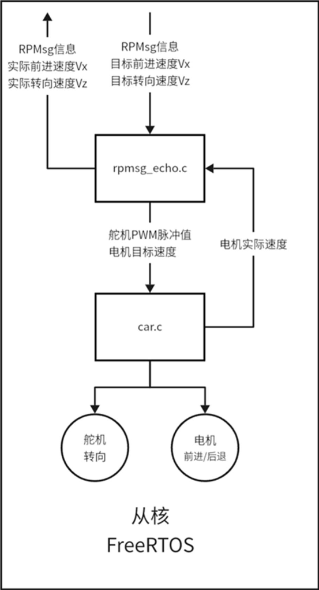
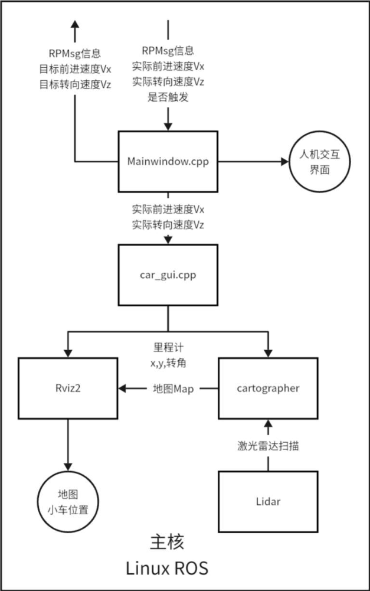

# 基于飞腾派多核异构的2d激光SLAM小车

## For English version, please click [here](#2d-slam-car-basedon-phytiumpi)

## 仓库说明
这是我参加2024年第八届全国大学生集成电路创新大赛-飞腾杯的项目，题目为基于飞腾多核异构处理器的创新应用开发。  
项目基于飞腾派，利用飞腾派多核异构处理器，主核运行Ubuntu，从核运行FreeRTOS，同时实现小车底盘控制和SLAM建图。  
最终获得奖项为华南赛区一等奖及全国三等奖。  
**此仓库仅作为个人学习记录，不提供任何技术支持，不保证代码的正确性和稳定性。**

## 目录
- [项目功能](#项目功能)
- [详细实现原理](#详细实现原理)
  - [从核：FreeRTOS](#从核freertos)
  - [主核：Ubuntu 22.04](#主核ubuntu-2004)
- [硬件架构](#硬件架构)
- [文件目录](#文件目录)
- [环境配置](#环境配置)
- [编译](#编译)
- [使用](#使用)

## 项目功能
- 基于飞腾派多核异构处理器，主核运行Ubuntu，从核运行FreeRTOS
- 从核实现底盘控制，包含后轮电机转速闭环控制，前轮舵机转向控制，并通过红外传感器检测前方障碍物实现紧急制动
- 主核提供人机交互界面对小车进行控制，同时通过激光雷达和里程计数据融合建图

### 详细实现原理
使用飞腾处理器，基于OpenAMP协议实现多核异构，首先四个核启动Ubuntu，然后切换为三个核运行Ubuntu(主核)，一个核运行FreeRTOS(从核)，利用RPMsg通信实现主核与从核的通信。


#### 从核：FreeRTOS
1. rpmsg-echo_os.c
- 运行RpmsgEchoTask，注册RPMsg信息接收回调函数，在其中接收目标速度Vx及Vz
- 对目标速度进行运动学求解，转向半径R=Vx/Vz，转向角度AngleR=atan(轮距/R)
- 根据舵机角度与脉冲转换公式，得到舵机脉冲与后轮目标速度
2. car.c
- 运行CarInitTask，初始化GPIO，通过IOPad设置引脚方向，注册中断回调函数
- 编码器A输出上升沿时触发中断，根据B的电平对当前周期的电机编码器脉冲加/减
- 循环运行CarControlTask，根据连接红外传感器的引脚的电平，判断前方是否有障碍物，若有则期望速度调为0
- 根据编码器脉冲数，得到电机实际速度
- 调用PI控制器，根据实际速度和目标速度得到PWM输出脉冲数
- 控制PWM输出特定脉冲数


#### 主核：Ubuntu 22.04
1. car_lidar_gui.py
- ROS2启动文件，启动包括cartographer、rviz2、lidar、car_gui等节点，实现一键启动
2. mainwindow.cpp
- 通过基于OpenAMP协议中的RPMsg通信，向从核发送目标速度并接收从核发来的实时速度Vx及Vz
- 运行基于Qt的上位机，通过人机交互界面的摇杆输入目标速度，并显示实时速度
3. car_gui.cpp
- 基于实时速度数据，对其进行转换并积分，得到base_link与odom之间的tf数据
- 在/odom话题中发布里程计tf数据
4. cartographer_node
- ROS中运行Cartographer，基于2d激光雷达数据和里程计进行实时建图


## 硬件架构
- 主控板：飞腾派4核处理器 ARM V8架构 64位DDR4 4GB内存 [飞腾派购买链接](https://detail.tmall.com/item.htm?abbucket=19&id=735300753163&ns=1&pisk=gWbqnUXj3rU4zN_4IQYZzHKJ3WLvyE2QuN96s1fMGKvDh1AM7TX_MK1gHO7wE1IbMhwx_jQPLVgbHoCi7FTgdJaQRsdXWF2BNc7HfxdM6I46IVxkkCtYF7M7RsCvWjkgOg4IQTGpIcmMIOYkqCRHSIYMn0Vy_ClDSKxiE0AHEdYGInDoZBRHsCmmm7kksBuDIF0mrLA6OqYMSOfuaCH1ZNb-TC-09WGoX3F8HnphiLui8Xd2mq1jfVg1oIxVSsvyNQ_ygnJe21OtyZX5sZ_v2uiJW_sFQGXTA0LVsiYDOsUqzefcVNR555iwntQPZZKrO2tVjC-HS3liS_8vU3bw-yDywgffjZBq_VAAlwtwp3PiWhTlRHjh3fFdZEAGBHQ_pqpcs6QdAezSmefPj9SN4PM9Z-IdWikibnAJapNzafVSFT5xj7RiXcK8wQJQgPotXn2t5m7Qzcn926RydSzA.&priceTId=213e38e517343416505615416e4bad&skuId=5084837441261&spm=a21n57.1.hoverItem.2&utparam=%7B%22aplus_abtest%22%3A%22aec74d7ced28e42c549ea94d8f312e41%22%7D&xxc=taobaoSearch)
- 底盘：阿克曼结构，双电机控制后轮驱动，舵机控制前轮转向，电机采用霍尔编码器 [底盘购买链接](https://detail.tmall.com/item.htm?id=644639616992&ns=1&pisk=giAZ35t_bfhaBjdZmwf4TTI8oHfOw1mS_IsfoEYc5GjGfEbcgHxjWGTmXnRVxEpsWtiTuPde4SNsXAL0gs1mV0GSNFQ1Msm75OXsPlQf7-cfSSbh6Z6tA2ZINFLOMPrmPpc70Ha8Ol2cmnfhKZ7PiNjGjW0FuZqciGX0xJblxifDmGcnta74iNjcn90FzaV0nG2gK6bP7PbDms0e-MQmZbOD9z7VI4377yN4ZGWNqFjUaedFSMe95My0hBJFQgV5YSVDTNYBWfe4axskeG65VHcQ_s8huhsBqbVFtTJJlZ-Z_5f6KpdO1BizyO-VfTACLY4e41-VECXUoSTNgifF-Q0beMOFfnANK4NPh6A5E1vIpc6f_a-D6hz4i3YBPCBpg0rhDd_RtaTt_W5kSZjyfoQnXLdvQo2VIwQFV2uUo2ZBYFem8Z2YH93d8ggZg-eAImFbQQGUH-BpzwSS7fC..&priceTId=213e38e517343418337115106e4bad&skuId=4647905065488&spm=a21n57.1.hoverItem.1&utparam=%7B%22aplus_abtest%22%3A%2266dfefa895a5b3b1b3d2164474e0c5a2%22%7D&xxc=ad_ztc)
- 电机驱动：AT8236双路驱动模块，带稳压板 [驱动购买链接](https://detail.tmall.com/item.htm?id=645944642035&ns=1&pisk=gS4s3EVaTdvsaO93sOCEd7vzTEgbl-_yCIGYZSLwMV3tHkNuhA5cjVrIhJeIBF5GjmHbIVn0bxkZhqN0F6WPzaPgsqmRUT7zZIyTz4c9Bhp2JHhmlfQ18M5Tsq0AUB8A4aNgekxedFhx96GqgjKTHcnpJbkKMfnTHvnKwbJtkqeAOvhiinpvXhKKpjkpDEh9XXhKNbhxHAhOOWHnMqHxZY8IatML16uefDOGIAFtdELYWZmsFlK2lEax6caY6vNUTyGsfYi3gjY3WJPY7PmhYH00TuwbD-jyxVNYXVhzsNTIy5EUlXzVgnMTIyNLSDOyzcZxG03xAILYOVDIvrgRypG3v5rYSROXkf4azmMoAsLm02Ur2ue6i_VKWjemqrWkSAFYZzqrPw-tyWZYFosPDUkSIl-XO0YjOY5COnxmr-8gwC0BmJottfWPO6tljchnO1zVOHHKXXcap61Bqa1..&priceTId=213e38e517343420350856212e4bad&skuId=5621113741703&spm=a21n57.1.hoverItem.1&utparam=%7B%22aplus_abtest%22%3A%226f66a720eb31fdb8741e9c80287950c2%22%7D&xxc=ad_ztc)
- 激光雷达：乐动LD14，三角测距，25米测量半径 [激光雷达购买链接](https://detail.tmall.com/item.htm?abbucket=19&id=645324033043&ns=1&pisk=gzyj3Kq44EYbaBTumZIrPkVU4yM_GP6elhiTxlp2XxHxW7Z35qSGixPS5zUSkKScif3_oxhggVuq5AZgRg7FL9r0mAcd8wWFXR3y8vvtXfLweunZCmBfU_SYmADO83JOT9Z0J7Yz3Knt2giZbcdYWjE-ecg-DEdYW4h-vD8xBAUOVYnKjIpvMV3Jwc0J6dnxkbn-jcvxWV3AVu3oXA3tZ3JSYNg8cgky6bNkzcExPdpTHOcjRqAwCdwjDjwTD4Zz48ijG2GubcvuHzrT3-claQDg4Wa_6PfeZxZTMxnUmt9SpoFzC0yNbCgYo8Z8nbteLjNtfXHtNhpTVx0SwRMdpUiuwoPTnrt6Bm24LfgnNGpi_YeE9WUXjMq-HcUitR7HnqETxJVEdTRxpuNTR5syMpuIoSR6VXvsV2S5VCAiKPJ0vnDWszlxqm7FVgOhijnoViyNVQ3-M0m4ygsWt91..&priceTId=213e38e517343424941136644e4bad&skuId=4823760483590&spm=a21n57.1.hoverItem.2&utparam=%7B%22aplus_abtest%22%3A%223fa55799c40f965c3909b491713e15e0%22%7D&xxc=taobaoSearch)
- 电池：12V 1800mA锂电池 [电池购买链接](https://item.taobao.com/item.htm?abbucket=19&id=657164512973&ns=1&pisk=g3Fx3520Egjmj5chis6ojJJ8CRboM5UVmozBscmDCuE850AGujXZ6ln8bmDmGmAt6PEajlUNuVi_flngnTf3urlZ1MAOt642Uz2aEo3X1Y_sJ2p1rxtYlj8j1MjhtLYS3ic_miRu939S80gj5Ag1ybgn-nGsCqa5yVgMcdObfz_-4VKXGqifN4gs-cGs5qtSN23BhqM6h3iS4VGsflGsCg6x0Cip6RfwYSFGUtRMs73xHcdiDCHUNBDrAznW1MN-kHoQl0d66mqHmKa8oidUrjPUv2qcNIEL87r-Pk1O2frzClgTV6-igJq4TYUPdQaoM0kIVWtXh2hxDvNjUeO7RAw8wjVfbpzuymMKZ8XPmAcYDJoEhTSzXzn0fSHWDgmgKzVjekskwlkTLP0TDsdbAgyatWUYsHmKSK_RydJZh4oguSkADKHfS4nhoqvwQYGEyDb-Xd96beg-xZY6QdkSw&priceTId=213e38e517343425306071414e4bad&skuId=5232197286265&spm=a21n57.1.hoverItem.3&utparam=%7B%22aplus_abtest%22%3A%2253a18c6704898fb4baace8dfd0d8e498%22%7D&xxc=taobaoSearch)

## 文件目录
```
2D-SLAM-car-basedon-phytiumpi/
├── docs/               # 文档
├── executable-files/   # 可执行文件
├── images/             # Readme中用到的图片
├── master-src/         # 主核ROS包
├── slave-src/          # 从核源代码
└── README.md           # 项目介绍
```

## 环境配置

### Windows系统下安装Ubuntu虚拟机
可以使用VMWare虚拟机，具体流程请参考[CSDN博客](https://blog.csdn.net/m0_70885101/article/details/137694608)。  
**注意** Ubuntu版本必须为20.04或22.04，否则飞腾系统编译环境不支持，且必须为x86架构。
```
Buildroot被设计为在x86 Linux系统上运行，我们只支持在Ubuntu20.04、Ubuntu22.04、Debian11这三种x86主机上运行phytium-linux-buildroot，不支持其他系统。
```

### 用虚拟机编译飞腾派系统镜像并烧入进SD卡内  
具体可参考[Phytium-linux-buildroot](https://gitee.com/phytium_embedded/phytium-linux-buildroot)中的README文档

**以下内容仅为编辑此README时可用的使用方法，具体情况可能会因原仓库更新而改变，请参考原仓库文档**

1. 下载依赖包
``` bash
sudo apt update
sudo apt install debianutils sed make binutils build-essential gcc g++ bash patch gzip bzip2 perl tar cpio unzip rsync file bc wget git debootstrap qemu-user-static binfmt-support debian-archive-keyring
```

2. 下载phytium-linux-buildroot
``` bash
git clone https://gitee.com/phytium_embedded/phytium-linux-buildroot.git
```

3. 配置配置文件
- 加载适用于ubuntu的defconfig  
加载 ubuntu defconfig配置文件  
``` bash
cd xxx/phytium-linux-buildroot
make phytium_ubuntu_defconfig
```
- 合并支持OpenAMP free_rtos的config  
修改**configs/openamp_standalone.config**中的变量**BR2_PACKAGE_PHYTIUM_STANDALONE_CPU_NAME**  
以及**configs/openamp_free_rtos.config**中的变量**BR2_PACKAGE_PHYTIUM_FREE_RTOS_CPU_NAME**  
改为**phytiumpi**  
然后合并配置文件
``` bash
./support/kconfig/merge_config.sh configs/phytium_ubuntu_defconfig configs/openamp_free_rtos.config
```
- 合并SD卡镜像config  
飞腾派默认只能通过SD卡启动，且**必须为闪迪SD卡**、**必须为闪迪SD卡**、**必须为闪迪SD卡**，重要的事说三遍，因为真的把我坑惨了（我使用三星一直没法安装桌面环境，更换闪迪之后马上解决）
``` bash
./support/kconfig/merge_config.sh configs/phytium_xxx_defconfig configs/phytiumpi_sdcard.config
```

- (可选)安装XFCE桌面
可以使用desktop.config配置文件，预先安装xfce桌面。  
``` bash
./support/kconfig/merge_config.sh configs/phytium_ubuntu_defconfig configs/desktop.config
```
``` bash
但是我不习惯xfce桌面，所以没有预先安装，而是在启动不带桌面的Ubuntu系统后安装的gnome桌面。  
具体为，烧录完成，启动系统后，连接网络，安装gnome桌面

sudo dhclient
sudo apt update
sudo apt -y install ubuntu-gnome-desktop
```
4. 编译  
这个过程巨久，主要看网速，因为要下载很多kernel源码
``` bash 
make
```
5. 烧录  
编译生成的镜像文件在**output/images**目录下，**sdcard.img**为SD卡镜像文件  
可以使用**dd**命令烧录进SD卡内，我是将其传回宿主机Windows再使用[win32diskimager](https://sourceforge.net/projects/win32diskimager/)烧录进SD卡内的，具体方法可以参考[CSDN博客](https://blog.csdn.net/Mr_LanGX/article/details/123338081)。

6. **!!! 启动 !!!**  
将烧写好系统的SD卡插入飞腾派，连接HDMI显示器、键盘、鼠标，接入网线，开机即可**启动**Ubuntu系统。  
普通用户名为user，root和user密码均为Phytium@123。


### 使用虚拟机配置飞腾FreeRTOS编译环境
也可以用Windows系统搭建编译环境，但是我没用过，具体请参考[Phytium-FreeRTOS-SDK](https://gitee.com/phytium_embedded/phytium-free-rtos-sdk)  
可以用跟上面编译系统时相同的虚拟机，具体配置流程可以参考[Linux_x86环境下SDK的安装方法](https://gitee.com/phytium_embedded/phytium-free-rtos-sdk/blob/master/docs/reference/usr/install_linux_x86_64.md)  
现在更新后的安装方式好像跟我当时的不一样，我已经不记得当时是怎么安装的了。应该跟着走就可以。

### 飞腾派Ubuntu 22.04系统安装下ROS2及Cartographer
1. 安装ROS2  
可以使用鱼香ROS一键安装，也可以根据[官方文档](https://docs.ros.org/en/foxy/Releases/Release-Humble-Hawksbill.html#)一步步走，我是用的鱼香ROS（鱼香肉丝yyds）
ROS相关的教程可以参考[CSDN博客](https://blog.csdn.net/qq_27865227/article/details/131363638)里的文章
``` bash
wget http://fishros.com/install -O fishros && . fishros
选择1一键安装ROS，选择更换系统源，选择版本为Hunble(桌面版)
```
2. 安装Cartographer  
可以参考[CSDN博客](https://blog.csdn.net/qq_27865227/article/details/132525447)，我忘了我用的是源码还是apt了  

## 编译

- 使用虚拟机编译从核可执行文件
把/slave_src/openamp_for_linux目录下的/src和/inc文件夹放入虚拟机中安装好SDK的openamp_for_linux目录下  
然后参考安装好SDK的openamp_for_linux目录下最新的的README进行编译  
本仓库中的[openamp_for_linux中的README文档](/slave-src/openamp_for_linux/README.md)为老版本的，不保证正确性，仅供参考  
我记得当时修改了openamp rpmsg通信的轮询逻辑，不然会卡死，不知道现在有没有更新。具体的修改内容应该是下面这个，但是我不确定了。

还修改了很多GPIO，PWM引脚的驱动，当时飞腾的FreeRTOS的驱动很多有问题。  
比如GPIO的中断注册的顶层函数虽然传入了触发模式和是否单次触发，但是根本没有调用，直接设置为上升沿和单次触发了。这里附上一些记录  
[GPIO中断注册有问题](/docs/GPIOint_issue.md)  
还有PWM的引脚定义也有问题，实际输出的通道是1，但是手册和例程写的都是0，导致设置死区之后，实际输出的脉冲为周期-设置的脉冲，反正很抽象，改了一堆东西，当时在驱动上花了很多时间，现在可能应该修复了吧。这里也贴一下记录  
[PWM引脚通道定义有问题](/docs/PWM_issue.md)  

- 使用飞腾派Ubuntu 22.04系统编译主核ROS包
启动飞腾派后，在飞腾派中创建工作空间
``` bash
mkdir -p ~/2dslamcar_ws/src/car_gui
git clone https://gitee.com/phytium_embedded/2D-SLAM-car-basedon-phytiumpi.git
```
将2D-SLAM-car-basedon-phytiumpi/master-src中的文件夹放入~/2dslamcar_ws/src/car_gui中，使用colcon编译
``` bash
cd ~/2dslamcar_ws
colcon build
```

## 使用

- 将编译好的从核可执行文件放入飞腾派系统中
将编译生成的 'openamp_core0.elf' 拷贝至飞腾派的`/lib/firmare`目录下

- 使用ROS2 launch文件启动人机交互界面和其他节点
1. (可选)加载我修改的cartographer的参数配置文件  
将2D-SLAM-car-basedon-phytiumpi/master-src/car2d.lua文件夹中的文件放入cartographer的configuration_files文件夹中  
具体的文件夹位置根据cartographer安装方式不同而不同，可以通过搜索`cartographer_ros/configuration_files`找到  
2. 启动launch文件  
进入工作空间，加载ROS2环境变量，启动launch文件
``` bash
cd ~/2dslamcar_ws
source install/setup.bash
ros2 launch car_gui car_lidar_gui.launch.py
```
由于演示视频较大，如有需要可以邮箱联系我 wangruifan2003@qq.com

更多详细信息请参考[项目文档](/docs/Design-document.pdf)

# 2D-SLAM-car-basedon-phytiumpi
## 2D-SLAM-car-basedon-phytiumpi

## Repository Description
This is my project for the 2024 8th National College Student Integrated Circuit Innovation Competition - Phytium Cup, titled "Innovative Application Development Based on Phytium Multi-core Heterogeneous Processor."
The project is based on Phytium Pi, utilizing Phytium Pi's multi-core heterogeneous processor, with the main core running Ubuntu and the slave core running FreeRTOS, simultaneously achieving car chassis control and SLAM mapping.
The project won the first prize in the South China Division and the third prize nationally.
- This repository is only for personal learning records, does not provide any technical support, and does not guarantee the correctness and stability of the code.

## Table of Contents
- [Project Features](#project-features)
- [Detailed Implementation Principles](#detailed-implementation-principles)
    - [Slave Core: FreeRTOS](#slave-core-freertos)
    - [Main Core: Ubuntu 22.04](#main-core-ubuntu-2204)
- [Hardware Architecture](#hardware-architecture)
- [File Directory](#file-directory)
- [Environment Configuration](#environment-configuration)
- [Compilation](#compilation)
- [Usage](#usage)

## Project Features
- Based on Phytium Pi multi-core heterogeneous processor, the main core runs Ubuntu, and the slave core runs FreeRTOS
- The slave core realizes chassis control, including closed-loop control of rear wheel motor speed, steering control of front wheel servo, and emergency braking by detecting obstacles ahead through infrared sensors
- The main core provides a human-machine interface to control the car and simultaneously maps using laser radar and odometer data fusion

### Detailed Implementation Principles
Using Phytium processor, based on OpenAMP protocol to achieve multi-core heterogeneity, first start Ubuntu on four cores, then switch to three cores running Ubuntu (main core), one core running FreeRTOS (slave core), and use RPMsg communication to achieve communication between the main core and the slave core.


#### Slave Core: FreeRTOS
1. rpmsg-echo_os.c
- Run RpmsgEchoTask, register RPMsg message reception callback function, receive target speed Vx and Vz
- Perform kinematic solution on the target speed, turning radius R=Vx/Vz, turning angle AngleR=atan(wheelbase/R)
- According to the conversion formula of servo angle and pulse, get the servo pulse and rear wheel target speed
2. car.c
- Run CarInitTask, initialize GPIO, set pin direction through IOPad, register interrupt callback function
- Trigger interrupt on the rising edge of encoder A output, add/subtract motor encoder pulses of the current cycle according to the level of B
- Loop run CarControlTask, judge whether there are obstacles ahead according to the level of the pin connected to the infrared sensor, if there are, set the expected speed to 0
- Get the actual speed of the motor according to the encoder pulses
- Call PI controller, get PWM output pulses according to actual speed and target speed
- Control PWM to output specific pulses


#### Main Core: Ubuntu 22.04
1. car_lidar_gui.py
- ROS2 launch file, start nodes including cartographer, rviz2, lidar, car_gui, etc., to achieve one-click start
2. mainwindow.cpp
- Send target speed to the slave core and receive real-time speed Vx and Vz from the slave core through RPMsg communication based on OpenAMP protocol
- Run the upper computer based on Qt, input target speed through the joystick of the human-machine interface, and display real-time speed
3. car_gui.cpp
- Convert and integrate real-time speed data to get tf data between base_link and odom
- Publish odometer tf data on the /odom topic
4. cartographer_node
- Run Cartographer in ROS, perform real-time mapping based on 2D laser radar data and odometer


## Hardware Architecture

- Main control board: Phytium Pi 4-core processor ARM V8 architecture 64-bit DDR4 4GB memory [Phytium Pi purchase link](https://detail.tmall.com/item.htm?abbucket=19&id=735300753163&ns=1&pisk=gWbqnUXj3rU4zN_4IQYZzHKJ3WLvyE2QuN96s1fMGKvDh1AM7TX_MK1gHO7wE1IbMhwx_jQPLVgbHoCi7FTgdJaQRsdXWF2BNc7HfxdM6I46IVxkkCtYF7M7RsCvWjkgOg4IQTGpIcmMIOYkqCRHSIYMn0Vy_ClDSKxiE0AHEdYGInDoZBRHsCmmm7kksBuDIF0mrLA6OqYMSOfuaCH1ZNb-TC-09WGoX3F8HnphiLui8Xd2mq1jfVg1oIxVSsvyNQ_ygnJe21OtyZX5sZ_v2uiJW_sFQGXTA0LVsiYDOsUqzefcVNR555iwntQPZZKrO2tVjC-HS3liS_8vU3bw-yDywgffjZBq_VAAlwtwp3PiWhTlRHjh3fFdZEAGBHQ_pqpcs6QdAezSmefPj9SN4PM9Z-IdWikibnAJapNzafVSFT5xj7RiXcK8wQJQgPotXn2t5m7Qzcn926RydSzA.&priceTId=213e38e517343416505615416e4bad&skuId=5084837441261&spm=a21n57.1.hoverItem.2&utparam=%7B%22aplus_abtest%22%3A%22aec74d7ced28e42c549ea94d8f312e41%22%7D&xxc=taobaoSearch)
- Chassis: Ackerman structure, dual motor control rear-wheel drive, servo control front-wheel steering, motor with Hall encoder [Chassis purchase link](https://detail.tmall.com/item.htm?id=644639616992&ns=1&pisk=giAZ35t_bfhaBjdZmwf4TTI8oHfOw1mS_IsfoEYc5GjGfEbcgHxjWGTmXnRVxEpsWtiTuPde4SNsXAL0gs1mV0GSNFQ1Msm75OXsPlQf7-cfSSbh6Z6tA2ZINFLOMPrmPpc70Ha8Ol2cmnfhKZ7PiNjGjW0FuZqciGX0xJblxifDmGcnta74iNjcn90FzaV0nG2gK6bP7PbDms0e-MQmZbOD9z7VI4377yN4ZGWNqFjUaedFSMe95My0hBJFQgV5YSVDTNYBWfe4axskeG65VHcQ_s8huhsBqbVFtTJJlZ-Z_5f6KpdO1BizyO-VfTACLY4e41-VECXUoSTNgifF-Q0beMOFfnANK4NPh6A5E1vIpc6f_a-D6hz4i3YBPCBpg0rhDd_RtaTt_W5kSZjyfoQnXLdvQo2VIwQFV2uUo2ZBYFem8Z2YH93d8ggZg-eAImFbQQGUH-BpzwSS7fC..&priceTId=213e38e517343418337115106e4bad&skuId=4647905065488&spm=a21n57.1.hoverItem.1&utparam=%7B%22aplus_abtest%22%3A%2266dfefa895a5b3b1b3d2164474e0c5a2%22%7D&xxc=ad_ztc)
- Motor driver: AT8236 dual-channel driver module with voltage regulator board [Driver purchase link](https://detail.tmall.com/item.htm?id=645944642035&ns=1&pisk=gS4s3EVaTdvsaO93sOCEd7vzTEgbl-_yCIGYZSLwMV3tHkNuhA5cjVrIhJeIBF5GjmHbIVn0bxkZhqN0F6WPzaPgsqmRUT7zZIyTz4c9Bhp2JHhmlfQ18M5Tsq0AUB8A4aNgekxedFhx96GqgjKTHcnpJbkKMfnTHvnKwbJtkqeAOvhiinpvXhKKpjkpDEh9XXhKNbhxHAhOOWHnMqHxZY8IatML16uefDOGIAFtdELYWZmsFlK2lEax6caY6vNUTyGsfYi3gjY3WJPY7PmhYH00TuwbD-jyxVNYXVhzsNTIy5EUlXzVgnMTIyNLSDOyzcZxG03xAILYOVDIvrgRypG3v5rYSROXkf4azmMoAsLm02Ur2ue6i_VKWjemqrWkSAFYZzqrPw-tyWZYFosPDUkSIl-XO0YjOY5COnxmr-8gwC0BmJottfWPO6tljchnO1zVOHHKXXcap61Bqa1..&priceTId=213e38e517343420350856212e4bad&skuId=5621113741703&spm=a21n57.1.hoverItem.1&utparam=%7B%22aplus_abtest%22%3A%226f66a720eb31fdb8741e9c80287950c2%22%7D&xxc=ad_ztc)
- Laser radar: LeDong LD14, triangulation, 25 meters measurement radius [Laser radar purchase link](https://detail.tmall.com/item.htm?abbucket=19&id=645324033043&ns=1&pisk=gzyj3Kq44EYbaBTumZIrPkVU4yM_GP6elhiTxlp2XxHxW7Z35qSGixPS5zUSkKScif3_oxhggVuq5AZgRg7FL9r0mAcd8wWFXR3y8vvtXfLweunZCmBfU_SYmADO83JOT9Z0J7Yz3Knt2giZbcdYWjE-ecg-DEdYW4h-vD8xBAUOVYnKjIpvMV3Jwc0J6dnxkbn-jcvxWV3AVu3oXA3tZ3JSYNg8cgky6bNkzcExPdpTHOcjRqAwCdwjDjwTD4Zz48ijG2GubcvuHzrT3-claQDg4Wa_6PfeZxZTMxnUmt9SpoFzC0yNbCgYo8Z8nbteLjNtfXHtNhpTVx0SwRMdpUiuwoPTnrt6Bm24LfgnNGpi_YeE9WUXjMq-HcUitR7HnqETxJVEdTRxpuNTR5syMpuIoSR6VXvsV2S5VCAiKPJ0vnDWszlxqm7FVgOhijnoViyNVQ3-M0m4ygsWt91..&priceTId=213e38e517343424941136644e4bad&skuId=4823760483590&spm=a21n57.1.hoverItem.2&utparam=%7B%22aplus_abtest%22%3A%223fa55799c40f965c3909b491713e15e0%22%7D&xxc=taobaoSearch)
- Battery: 12V 1800mA lithium battery [Battery purchase link](https://item.taobao.com/item.htm?abbucket=19&id=657164512973&ns=1&pisk=g3Fx3520Egjmj5chis6ojJJ8CRboM5UVmozBscmDCuE850AGujXZ6ln8bmDmGmAt6PEajlUNuVi_flngnTf3urlZ1MAOt642Uz2aEo3X1Y_sJ2p1rxtYlj8j1MjhtLYS3ic_miRu939S80gj5Ag1ybgn-nGsCqa5yVgMcdObfz_-4VKXGqifN4gs-cGs5qtSN23BhqM6h3iS4VGsflGsCg6x0Cip6RfwYSFGUtRMs73xHcdiDCHUNBDrAznW1MN-kHoQl0d66mqHmKa8oidUrjPUv2qcNIEL87r-Pk1O2frzClgTV6-igJq4TYUPdQaoM0kIVWtXh2hxDvNjUeO7RAw8wjVfbpzuymMKZ8XPmAcYDJoEhTSzXzn0fSHWDgmgKzVjekskwlkTLP0TDsdbAgyatWUYsHmKSK_RydJZh4oguSkADKHfS4nhoqvwQYGEyDb-Xd96beg-xZY6QdkSw&priceTId=213e38e517343425306071414e4bad&skuId=5232197286265&spm=a21n57.1.hoverItem.3&utparam=%7B%22aplus_abtest%22%3A%2253a18c6704898fb4baace8dfd0d8e498%22%7D&xxc=taobaoSearch)

## File Directory
```
2D-SLAM-car-basedon-phytiumpi/
├── docs/               # Documents
├── executable-files/   # Executable files
├── images/             # Images used in the Readme
├── master-src/         # Main core ROS package
├── slave-src/          # Slave core source code
└── README.md           # Project introduction
```

## Environment Configuration

### Install Ubuntu Virtual Machine on Windows

You can use VMWare virtual machine, please refer to [CSDN Blog](https://blog.csdn.net/m0_70885101/article/details/137694608) for detailed steps.  
**Note** The Ubuntu version must be 20.04 or 22.04, otherwise the Phytium system compilation environment is not supported, and it must be x86 architecture.
```
Buildroot is designed to run on x86 Linux systems, we only support running phytium-linux-buildroot on Ubuntu 20.04, Ubuntu 22.04, Debian 11 x86 hosts, other systems are not supported.
```

### Compile Phytium Pi System Image with Virtual Machine and Burn into SD Card  
Please refer to the README document in [Phytium-linux-buildroot](https://gitee.com/phytium_embedded/phytium-linux-buildroot) for details.

**The following content is only the usage method available when editing this README, the specific situation may change due to the update of the original repository, please refer to the original repository documentation**

1. Download dependencies
``` bash
sudo apt update
sudo apt install debianutils sed make binutils build-essential gcc g++ bash patch gzip bzip2 perl tar cpio unzip rsync file bc wget git debootstrap qemu-user-static binfmt-support debian-archive-keyring
```

2. Download phytium-linux-buildroot
``` bash
git clone https://gitee.com/phytium_embedded/phytium-linux-buildroot.git
```

3. Configure configuration files
- Load the defconfig suitable for Ubuntu  
Load the ubuntu defconfig configuration file  
``` bash
cd xxx/phytium-linux-buildroot
make phytium_ubuntu_defconfig
```
- Merge the config supporting OpenAMP free_rtos  
Modify the variable **BR2_PACKAGE_PHYTIUM_STANDALONE_CPU_NAME** in **configs/openamp_standalone.config**  
And the variable **BR2_PACKAGE_PHYTIUM_FREE_RTOS_CPU_NAME** in **configs/openamp_free_rtos.config**  
Change to **phytiumpi**  
Then merge the configuration files
``` bash
./support/kconfig/merge_config.sh configs/phytium_ubuntu_defconfig configs/openamp_free_rtos.config
```
- Merge SD card image config  
Phytium Pi can only be started through SD card by default, and **must be SanDisk SD card**, **must be SanDisk SD card**, **must be SanDisk SD card**, important things to say three times, because it really caused me a lot of trouble (I used Samsung and couldn't install the desktop environment, but it was solved immediately after changing to SanDisk)
``` bash
./support/kconfig/merge_config.sh configs/phytium_xxx_defconfig configs/phytiumpi_sdcard.config
```

- (Optional) Install XFCE desktop
You can use the desktop.config configuration file to pre-install the xfce desktop.  
``` bash
./support/kconfig/merge_config.sh configs/phytium_ubuntu_defconfig configs/desktop.config
```
``` bash
But I am not used to the xfce desktop, so I did not pre-install it, but installed the gnome desktop after starting the Ubuntu system without a desktop.  
Specifically, after burning is completed, start the system, connect to the network, and install the gnome desktop

sudo dhclient
sudo apt update
sudo apt -y install ubuntu-gnome-desktop
```
4. Compile  
This process is very long, mainly depending on the network speed, because a lot of kernel source code needs to be downloaded
``` bash 
make
```
5. Burn  
The compiled image files are in the **output/images** directory, **sdcard.img** is the SD card image file  
You can use the **dd** command to burn it into the SD card, I transferred it back to the host Windows and used [win32diskimager](https://sourceforge.net/projects/win32diskimager/) to burn it into the SD card, please refer to [CSDN Blog](https://blog.csdn.net/Mr_LanGX/article/details/123338081) for detailed steps.

6. **!!! Start !!!**  
Insert the SD card with the system burned into Phytium Pi, connect HDMI display, keyboard, mouse, plug in the network cable, and turn on the power to **start** the Ubuntu system.  
The common username is user, and the passwords for root and user are both Phytium@123.


### Configure Phytium FreeRTOS Compilation Environment Using Virtual Machine
You can also use the Windows system to build the compilation environment, but I haven't used it, please refer to [Phytium-FreeRTOS-SDK](https://gitee.com/phytium_embedded/phytium-free-rtos-sdk)  
You can use the same virtual machine as above to compile the system, please refer to [Linux_x86 Environment SDK Installation Method](https://gitee.com/phytium_embedded/phytium-free-rtos-sdk/blob/master/docs/reference/usr/install_linux_x86_64.md)  
The updated installation method now seems to be different from what I used at the time, I don't remember how I installed it at that time. It should work by following the steps.

### Install ROS2 and Cartographer on Phytium Pi Ubuntu 22.04 System
1. Install ROS2  
You can use Fishros ROS one-click installation, or follow the [official documentation](https://docs.ros.org/en/foxy/Releases/Release-Humble-Hawksbill.html#) step by step, I used Fishros ROS (Fish-flavored shredded pork yyds)
ROS-related tutorials can be found in the articles in [CSDN Blog](https://blog.csdn.net/qq_27865227/article/details/131363638)
``` bash
wget http://fishros.com/install -O fishros && . fishros
Select 1 to install ROS with one click, choose to change the system source, and select the version as Humble (desktop version)
```
2. Install Cartographer  
Please refer to [CSDN Blog](https://blog.csdn.net/qq_27865227/article/details/132525447), I forgot whether I used the source code or apt.

## Compilation

- Use virtual machine to compile slave core executable files
Put the /slave_src/openamp_for_linux directory's /src and /inc folders into the openamp_for_linux directory of the virtual machine with the SDK installed  
Then refer to the latest README in the openamp_for_linux directory with the SDK installed for compilation  
The [README document in openamp_for_linux](/slave-src/openamp_for_linux/README.md) in this repository is an old version, not guaranteed to be correct, for reference only  
I remember modifying the polling logic of openamp rpmsg communication at that time, otherwise it would get stuck, I don't know if it has been updated now. The specific modification content should be the following, but I am not sure.

Also modified a lot of GPIO, PWM pin drivers, many drivers of Phytium's FreeRTOS had problems at that time.  
For example, the top-level function of GPIO interrupt registration, although the trigger mode and whether it is a single trigger are passed in, it is not called at all, and it is directly set to rising edge and single trigger. Here are some records  
[GPIO interrupt registration has problems](/docs/GPIOint_issue.md)  
Also, the pin definition of PWM has problems, the actual output channel is 1, but the manual and examples write 0, resulting in the actual output pulse being period - set pulse after setting the dead zone, anyway, it is very abstract, modified a lot of things, spent a lot of time on the driver at that time, it should be fixed now. Here are some records  
[PWM pin channel definition has problems](/docs/PWM_issue.md)  

- Use Phytium Pi Ubuntu 22.04 system to compile main core ROS package
After starting Phytium Pi, create a workspace in Phytium Pi
``` bash
mkdir -p ~/2dslamcar_ws/src/car_gui
git clone https://gitee.com/phytium_embedded/2D-SLAM-car-basedon-phytiumpi.git
```
Put the folders in 2D-SLAM-car-basedon-phytiumpi/master-src into ~/2dslamcar_ws/src/car_gui, and use colcon to compile
``` bash
cd ~/2dslamcar_ws
colcon build
```

## Usage

- Put the compiled slave core executable files into the Phytium Pi system
Copy the compiled 'openamp_core0.elf' to the `/lib/firmware` directory of Phytium Pi

- Use ROS2 launch file to start the human-machine interface and other nodes
1. (Optional) Load my modified cartographer parameter configuration file  
Put the files in the 2D-SLAM-car-basedon-phytiumpi/master-src/car2d.lua folder into the configuration_files folder of cartographer  
The specific folder location varies depending on the installation method of cartographer, you can find it by searching `cartographer_ros/configuration_files`  
2. Start the launch file  
Enter the workspace, load ROS2 environment variables, and start the launch file
``` bash
cd ~/2dslamcar_ws
source install/setup.bash
ros2 launch car_gui car_lidar_gui.launch.py
```
Due to the large size of the demo video, please contact me via email wangruifan2003@qq.com if needed

For more detailed information, please refer to [Project Documentation](/docs/Design-document.pdf)
